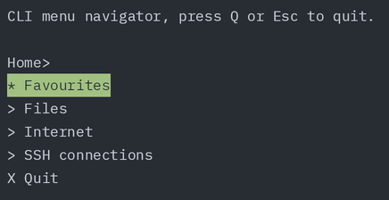

# climenu
___
## Overview
`climenu` provides a fairly simple way to configure `simple-term-menu` to act as a command line navigable menu system.  As well as being able to be configured for launching programmes, entries an be added for scripts, start an ssh session, basically almost anything you can write a cli command for. 

## Installation
Install [`simple-term-menu`](https://github.com/IngoMeyer441/simple-term-menu/tree/develop)

Download,  unzip, copy to a  directory of your choice, here it is `.climenu`in the home directory, and make `climenu.sh` executable
```bash
wget https://github.com/graynada/climenu/archive/refs/heads/main.zip
unzip main.zip
mkdir $HOME/.climenu
mv climenu-main/* $HOME/.climenu
rm -r climenu-main
rm main.zip
chmod +x $HOME/.climenu/climenu.sh
```

## Use

Run 'climenu.sh'
```bash
$HOME/.climenu/climenu.sh
```
I set up an alias `m` to run climenu

### Result
With default `config.py`<br>




## Configure

Modify `config.py`

Add a menu:
```
new_menu = Menu(name="Name", items=[sub_menu_1, sub_menu_2, launcher_1, launcher_2])
```

Add new launcher:
```
new_launcher = Launcher(name="Launcher", actions=["part_1", "part_2"])
```
eg:
```
update_system = Launceher(name="Update All", ["sudo", "apt", "upgrade", "-y"])
```
